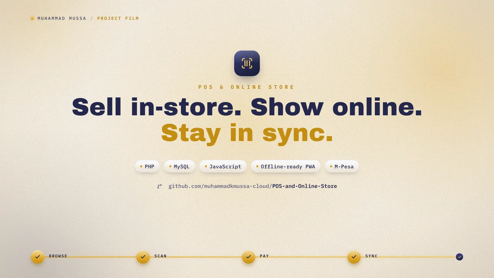

# POS and Online Store — POS + Online Catalogue + WhatsApp Ordering

https://github.com/user-attachments/assets/5819aa03-7ace-405b-b6fe-056944235392



A **connected Point-of-Sale (POS) and online catalogue** for a computer & electronics retailer. The physical shop and the web catalogue read the **same inventory** in real time, and the POS keeps working **offline** when the internet drops (queue-and-sync).

Built with **plain HTML, CSS & JavaScript** on the front end and **PHP + MySQL** on the back end, structured to deploy on **cPanel** with no build step.

> ✅ **Catalogue + WhatsApp mode is live.** Public online shop is now a professional product catalogue with **Order on WhatsApp** as primary CTA. Online cart/checkout and public M-Pesa STK are **preserved but disabled via feature flags** for future re-activation. POS remains source of truth.

---

## What it does

| Area | Detail |
| --- | --- |
| **POS terminal** | Cashier cart, barcode/serial search, discounts, receipt printing, **sale source tracking** (Walk-in/WhatsApp/Phone/Other) |
| **Online catalogue** | Storefront catalogue, **variant selectors** (RAM/Storage/Colour/Condition), **Order on WhatsApp** CTA — same stock as the shop, **no auto sale** |
| **WhatsApp ordering** | Configurable sales number (Kenyan normalization 07→254...), structured prefilled message (product/variant/condition/price/SKU/URL), OG metadata for rich preview, lightweight lead tracking |
| **Shared inventory** | One database for both channels; POS sale instantly reduces shop stock |
| **Product variants** | `product_variants` table: label, RAM, storage, colour, condition_type, grade, price_override, SKU; From pricing on cards |
| **Condition tracking** | `condition_type` (new/used/refurbished), `condition_grade`, `condition_notes`, `battery_notes` |
| **Serial / IMEI tracking** | High-value units tracked per serial number, warranty expiry |
| **Offline POS** | Service Worker + IndexedDB cache; sales queue locally and sync later |
| **Returns & warranty** | Return lifecycle tied to serial numbers; per-unit warranty expiry |
| **Sale void / cancel** | Admins void a mistaken sale — stock restored automatically |
| **Discount authorisation** | Optional manager PIN gate for discounts above threshold |
| **CSV export** | Sales (filtered by source), products, reports, WhatsApp enquiries |
| **Suppliers** | Supplier directory; GRNs link to saved supplier (name snapshotted) |
| **Product images** | Gallery with primary; OG image for WhatsApp preview |
| **Delivery fees** | Zone-based, resolved server-side (used when checkout re-enabled) |
| **Email notifications** | HTML order confirmations + low-stock alerts (PHP mail or SMTP) |
| **M-PESA** | POS M-Pesa via `mpesa_enabled`; **online M-Pesa disabled** via `mpesa_online_enabled=0` but callbacks, transactions, migrations preserved |
| **Order tracking** | Track page for online orders (when checkout enabled) |
| **Z-report / close-of-day** | Per-cashier till reconciliation |
| **Reporting** | Revenue, profit, VAT, purchases by supplier, **sale source breakdown**, **WhatsApp enquiries** total/converted |
| **Open Graph SEO** | Product pages emit `og:title`, `og:description`, `og:image`, `og:url`, `og:type=product` for WhatsApp rich preview |

**Business rules:**
- Currency **KSh**, prices exclusive of **16% VAT** (VAT shown on receipts).
- Inventory tracked **at serial/IMEI level** for serialized products.
- Public shop: **Catalogue + WhatsApp** — no cart checkout, no auto stock deduction, sales completed via POS.
- POS remains **source of truth** for all sales, profit, inventory, IMEI tracking.
- Feature flags: `online_checkout_enabled=0`, `mpesa_online_enabled=0`, `whatsapp_ordering_enabled=1` (reversible).

---

## Catalogue + WhatsApp Mode (Current Default)

**Why:** Reduce fraud/complexity of public checkout while keeping professional online presence and capturing leads via WhatsApp, which customers already use.

**Flow:**
1. Customer browses `/shop` → `/shop/products` → `/shop/product/{id}`
2. On product page, selects variant (RAM/Storage/Colour/Condition) → live price/SKU/condition update
3. Clicks **Order on WhatsApp** (primary) → prefilled message opens `https://wa.me/{number}?text={encoded}`:
   ```
   Hello {shop},
   I'm interested in:
   Product: {name}
   Variant: {ram/storage/colour/label}
   Colour: {colour}
   Condition: {condition}
   Grade: {grade}
   Price shown: {price}
   Product Code: {sku}
   Product page: {url}
   Is this available?
   ```
   - No cost/profit/IMEI/supplier exposed
   - Out-of-stock → **Ask About Availability** with different template
4. Lightweight tracking: JS `fetch` POST to `/shop/whatsapp-enquiry` (CSRF-protected) → `whatsapp_enquiries` table (product_id, variant_id, product_name, variant_label, price_shown, product_url, condition_type, source_page, created_at)
5. Conversation on WhatsApp → deal agreed → cashier creates sale in POS with **Sale Source = WhatsApp** and optional **WhatsApp Enquiry ID** link → inventory, IMEI, profit, receipt, reports as normal

**Future re-activation:** Set `online_checkout_enabled=1` and `mpesa_online_enabled=1` in Settings → WhatsApp & Online. Existing checkout code, M-Pesa STK, callbacks, transactions are preserved.

**SEO / WhatsApp preview:** Product page sets OG tags using primary image absolute URL (`url('uploads/p/...')`) and variant summary, so WhatsApp shows rich preview without fake image attachment.

---

## Feature Flags

Stored in `shop_settings` (Settings → WhatsApp & Online, admin only):

| Key | Default | Purpose |
| --- | --- | --- |
| `online_checkout_enabled` | 0 | Enable public cart/checkout. OFF = catalogue mode |
| `mpesa_online_enabled` | 0 | Enable public M-Pesa STK. OFF blocks server-side even if `mpesa_enabled=1` |
| `whatsapp_ordering_enabled` | 1 | Enable WhatsApp CTA as primary |
| `whatsapp_sales_number` | '' | Sales number, Kenyan formats: 07XXXXXXXX, 2547XXXXXXXX, +2547XXXXXXXX → normalized to 254... for wa.me |
| `whatsapp_message_template` | '' | Optional custom template with placeholders {product_name} {variant} {ram} {storage} {colour} {condition} {grade} {price} {sku} {product_url} {shop_name} |
| `mpesa_enabled` | 0 | Master M-Pesa switch for POS + online |

Normalization: `normalize_whatsapp_number()` handles 07→2547, 7→2547, 254 stays, validates 10-15 digits, rejects leading 0 otherwise.

Server-side enforcement: `ShopController::cart()`, `apiCart()`, `checkout()` return 403/unavailable when flag OFF; POS M-Pesa still works via `mpesa_enabled`.

---

## How offline mode works (Piece 5)

1. **App shell caching** — Service Worker caches POS screen
2. **Offline catalogue** — active products cached in IndexedDB
3. **Offline sales queue** — sale saved locally with `client_ref` + `device_id`, printable pending receipt
4. **Auto-sync** — POST to `/pos/sync`, idempotent via UNIQUE(device_id, client_ref)

---

## Roles & permissions

| Capability | Admin | Cashier |
| --- | :-: | :-: |
| POS, sales, returns, expenses | ✅ | ✅ |
| View products & stock (read-only) | ✅ | ✅ |
| Create/edit products, variants, units, adjustments, GRN | ✅ | ❌ |
| Categories, brands, suppliers | ✅ | ❌ |
| Barcode/label generation | ✅ | ❌ |
| Create returns | ✅ | ✅ |
| Approve / reject returns | ✅ | ❌ |
| Delete expenses | ✅ | ❌ |
| Void sale / M-PESA mark-paid & retry | ✅ | ❌ |
| Reports (revenue, profit, VAT, purchases, **sale source**, **WhatsApp**) | ✅ | ❌ |
| Z-report | any | own day only |
| Settings (shop details, VAT, **WhatsApp & Online flags**, M-Pesa, delivery, email) | ✅ | ❌ |
| Staff management | ✅ | ❌ |

---

## Receipts & printing

- PDF receipt `/sales/{id}/pdf` (dependency-free writer)
- Thermal 80mm/58mm `/sales/{id}/print?size=80`
- Barcode labels: shelf + serial, Code 128 SVG, A4 or 60×40 thermal
- Generate barcode on product form, auto-generate serials

## VAT report (KRA) & Purchases by supplier

- `/reports/vat`: output VAT, VAT on returns (re-taxed at sale's effective rate), input VAT (GRN costs × rate), daily breakdown, CSV
- `/reports/purchases`: GRNs grouped by supplier (saved + free-text), deliveries, net, est. input VAT, share %, drill-down, CSV

## Suppliers, images, delivery, email & M-PESA

- **Suppliers** `/suppliers`: directory, GRN linkage with name snapshot, deactivate instead of delete
- **Product images**: gallery, primary, safe streaming `uploads/p/{filename}`, OG image for WhatsApp preview
- **Delivery zones**: Settings → Delivery, server-resolved fee, snapshotted on order
- **Email**: `Mailer` via mail() or SMTP, order confirmation + low-stock (once per 24h, best-effort)
- **M-PESA**: Daraja STK push, sandbox/live, paybill/till, callback `/mpesa/callback?token=...`, admin Mark paid / Re-send prompt, auto-void on push failure. **Online M-Pesa disabled** in catalogue mode via `mpesa_online_enabled=0` but code preserved.

## Order tracking, Z-reports & hardening

- Track page `/shop/track`: number + phone (last 9 digits), rate-limited
- Z-report: live per-day/cashier summary, close snapshot, admin can view all
- Timezone `Africa/Nairobi` via `APP_TIMEZONE`
- Hardening: `app/`, `schema/`, `tools/`, `storage/` deny, dotfile deny, `router-dev.php` dev-only, installer guard, login lockout (5→15min), POST+CSRF logout, security headers, session hardening, activity log, UNIQUE(device_id, client_ref), sequence retry

---

## Tech stack

- **Backend** PHP 8+ PDO, no Composer, MySQL (SQLite dev)
- **Frontend** HTML/CSS/vanilla JS, no frameworks
- **Design** Apple-inspired blue & white, `#0071e3` on `#f5f5f7`, WhatsApp green `#25D366` for CTA
- **Offline** Service Worker + IndexedDB
- **Security** bcrypt, CSRF, prepared statements, rate-limit, CSP, audit log

---

## Project structure

```
khamis-computers/
├── public_html/              ← cPanel public_html
│   ├── index.php             ← front controller, 90+ routes incl. shop/whatsapp-enquiry
│   ├── .htaccess
│   ├── router-dev.php
│   └── assets/css/js/
├── app/
│   ├── bootstrap.php
│   ├── config/config.php
│   ├── helpers/functions.php ← flags, whatsapp_number(), normalize, build_whatsapp_message()
│   ├── core/                 ← Database, Router, View, Auth, Csrf, Schema (product_variants, whatsapp_enquiries, sale_source, condition fields)
│   ├── controllers/          ← ShopController (catalogue mode, OG, whatsappEnquiry), PosController (sale_source), SettingsController (WhatsApp flags), SaleController (source filter), ReportController (source + WhatsApp metrics)
│   ├── models/               ← Product (variants(), fromPrice()), ProductVariant, Sale (source filter), SaleService (sale_source, whatsapp_enquiry_id), Setting, etc.
│   ├── services/             ← MpesaService, Mailer, LowStock
│   └── views/                ← shop (home, browse, product variant-aware + WhatsApp CTA, cart unavailable), pos (sale_source selector + recent enquiries), sales (source column), reports (source breakdown + WhatsApp KPIs), settings (WhatsApp & Online tab)
├── schema/schema.sql
├── tools/install.php
├── storage/
├── docs/                     ← cpanel-deployment.md, workflows.md, catalogue-whatsapp.md
└── .env.example
```

---

## Quick start (local)

```bash
git clone <repo-url> && cd khamis-computers
php tools/install.php --fresh
php -S 0.0.0.0:8080 -t public_html public_html/router-dev.php
# http://localhost:8080
```

Demo: `admin@khamis.local` / `admin1234`, `cashier@khamis.local` / `cashier1234`

MySQL: copy `.env.example` → `.env`, set `DB_DRIVER=mysql`, credentials, re-run installer.

---

## Deploying to cPanel

Full guide: [docs/cpanel-deployment.md](docs/cpanel-deployment.md) — includes new WhatsApp settings.

Short:
1. Create MySQL DB + user
2. Upload `public_html/` contents to cPanel public_html, `app/`, `schema/`, `storage/`, `.env` outside web root
3. Set `.env` DB creds
4. Import `schema/schema.sql` or hit `/install` once
5. Delete install route + `tools/` in prod
6. Settings → WhatsApp & Online → set sales number (07XXXXXXXX) → Save
7. Verify OG tags: view product page source → `og:image` absolute HTTPS

---

## Build roadmap

| # | Piece | Status |
| --- | --- | --- |
| 1 | Foundation | ✅ |
| 2 | Inventory | ✅ |
| 3 | POS terminal | ✅ |
| 4 | Online shop (guest checkout) | ✅ (preserved, disabled by flag) |
| 5 | Offline POS | ✅ |
| 6 | Orders & reports | ✅ |
| 7 | Polish — roles, staff, settings, PDF | ✅ |
| 8 | Strengthening — suppliers, images, delivery, email, M-Pesa | ✅ |
| 9 | Operations — tracking, Z-report, hardening | ✅ |
| 10 | Integration audit — 14 bugs fixed, harness in tools/ | ✅ |
| 11 | VAT + barcode labels | ✅ |
| 12 | Purchases by supplier | ✅ |
| 13 | **Catalogue + WhatsApp mode** — feature flags, variant-aware product pages, WhatsApp CTA with structured message, OG metadata, server-side checkout guards, sale_source tracking (Walk-in/WhatsApp/Phone/Other), WhatsApp enquiries lead table, POS source selector + recent leads, reports by source + WhatsApp KPIs, M-Pesa preserved | ✅ done |

---

## License

MIT

